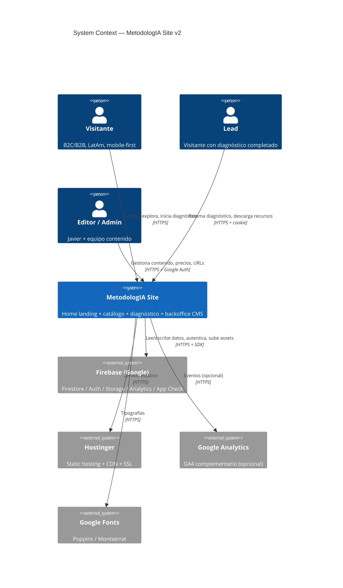
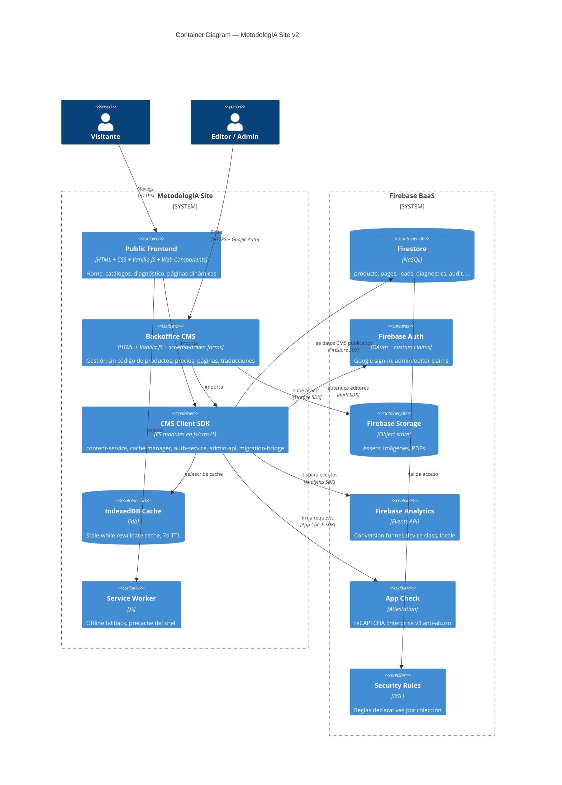
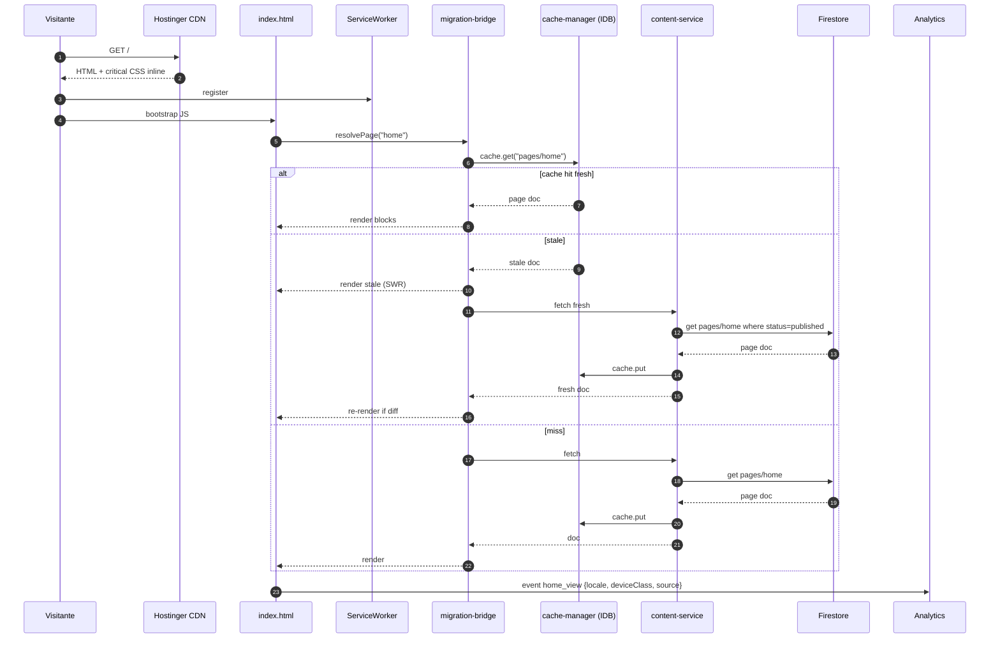
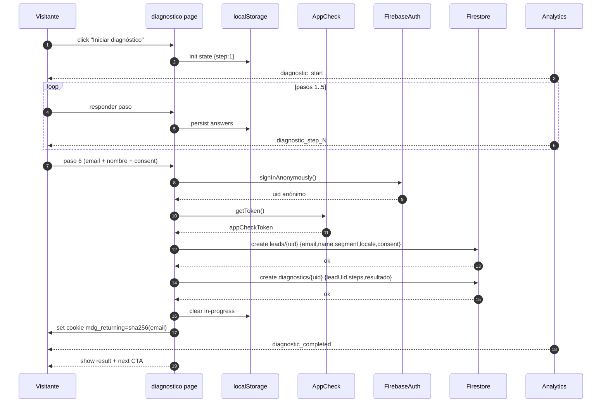
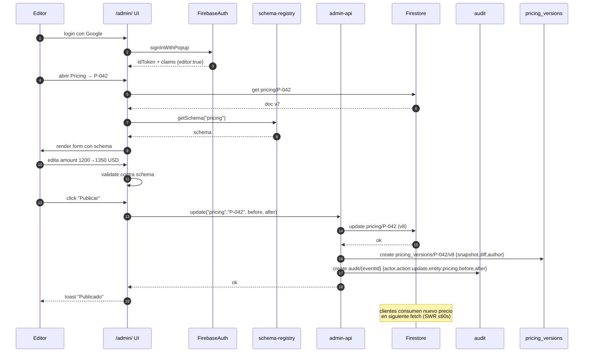
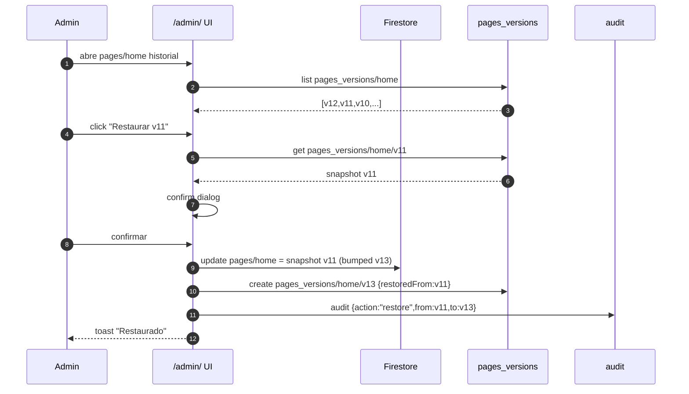
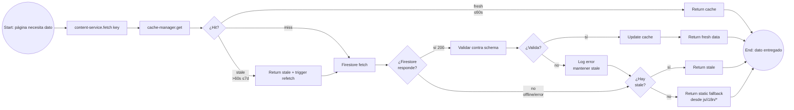

# Feature Specification: Home como Landing Vendedora (3 CTAs Primarios)

**Feature Branch**: `009-home-landing-sales`
**Created**: 2026-04-14
**Revised**: 2026-04-14 (v2 — Socratic refinement + responsive + stack constraints)
**Status**: Draft v2
**Input (v1)**: "Requiero crear una versión nueva de mi sitio web, pero mucho más vendedora. El home es una landing que invita a (1) iniciar un diagnóstico gratuito, (2) usar un recurso, o (3) conocer nuestra oferta educativa. El branding esperado está demostrado en las cartillas/playbooks Neo-Swiss del workspace."
**Input (v2 amendment)**: Full responsive (mobile/tablet/desktop native), stack desplegable en Hostinger (HTML/CSS/JS), debate socrático para afinar intención, mejorar requerimiento y trazar mejor especificación, revisando `workspace/2026-04-10-site-reconstruction/inputs`.

---

## 1. Debate Socrático — Intención y Restricciones

### 1.1 Intención Real del Usuario (cuestionamiento)

**Pregunta**: ¿El objetivo es "tres rutas iguales de conversión" o "una sola intención de venta con dos escape routes para reducir abandono"?

**Tensión**: Tres CTAs con igual jerarquía diluyen la decisión y bajan conversión (ley de Hick). Pero el visitante que no está listo para diagnóstico rebota si solo ve una opción.

**Resolución**: Es una **pirámide de intención**, no tres rutas iguales.

- **CTA Primario (P1)** — Diagnóstico gratuito: peso visual dominante, arriba del fold, color oro, tamaño XL.
- **CTA Secundario (P2)** — Recurso gratuito: peso medio, outline, disponible junto al primario pero visualmente subordinado.
- **CTA Terciario (P3)** — Oferta educativa: link con chevron en nav + card en sección dedicada, sin competir con el hero.

**Por qué**: El diagnóstico es el único CTA que produce un **lead con contexto** (segmento + madurez + intent). Los otros dos capturan audiencias tempranas que aún no están listas para compartir datos. Degradar P2/P3 a "escape routes con peso visual decreciente" multiplica la conversión del P1 sin sacrificar los tempranos.

---

### 1.2 Identidad Visual — Presente vs Futuro

**Pregunta**: El home actual usa estética dark startup (navy #0B2545 + oro + glass), y el usuario dice "refleja la identidad pero no el futuro". Las cartillas premium (`cartilla-onboarding-programa-v11.html`, `playbook-deep-research-ia-v1.html`) usan Neo-Swiss Light (#F9FAFB base, navy #122562 ink, oro #FFD700 accent). ¿Cuál es "el futuro"?

**Resolución**: **Neo-Swiss Light es el futuro. Dark Mode es el mirror opcional.**

Evidencia en inputs:
- `--bg: #F9FAFB` (light default), `--bg: #0B2545` (dark mirror)
- Mismo sistema tipográfico en ambos: Poppins head / Montserrat body / Trebuchet MS notes
- Misma paleta: navy, gold, blue, white, lavender implícito
- Mismos radios: 6/12/20/32 px
- Mismas shadows: glow suave en light, glow denso en dark

**Implicación**: El home v2 debe:
1. Partir de **light por defecto** (respetando `prefers-color-scheme: light`)
2. Ofrecer **toggle a dark** persistente en `localStorage`
3. Mirror exacto del sistema de las cartillas — sin introducir tokens nuevos
4. Dark mode es el mirror, no el default

---

### 1.3 Restricciones de Stack — Hostinger Static

**Pregunta**: ¿Qué tecnologías son viables en Hostinger con deployment vía git pull?

**Realidad técnica** (verificada contra el repo):
- **Viable**: HTML estático, CSS (custom props + Tailwind build), Vanilla JS, Web Components, Firebase client SDK (ya integrado en `js/cms/`), Firestore, Firebase Auth, Firebase Analytics, localStorage, Service Worker/PWA.
- **No viable sin server**: Node runtime, Express, SSR, endpoints personalizados, secrets management server-side.
- **Ya integrado en el repo**: Firebase client SDK, i18n module (`js/i18n/`), Web Components (`components/SiteHeader.js`, `components/SiteFooter.js`), Tailwind build (`dist/output.css`), CMS service modules.

**Resolución**: **Stack v2 = HTML + CSS (custom props + Tailwind prebuilt) + Vanilla JS + Web Components + Firebase client SDK**. Cero dependencias nuevas. Todo el backend corre en Firestore desde el cliente, gobernado por security rules.

---

### 1.4 Responsive — Native en Todos los Dispositivos

**Pregunta**: ¿Qué significa "full responsive, mobile native, desktop native, tablet ready"?

**Interpretación**: No es "responsive CSS adaptativo"; es **diseño específico por viewport class con transiciones fluidas**.

**Resolución — Viewport classes + breakpoints**:

| Class | Range | Target devices | Layout |
|---|---|---|---|
| `xs` | 360–389 px | iPhone SE, pequeños Android | 1-col hero, CTA stack vertical, nav drawer |
| `sm` | 390–767 px | iPhone 12–15, Pixel | 1-col hero, CTAs side-by-side condensed |
| `md` | 768–1023 px | iPad portrait, tablet | 1-col hero ancho, CTAs horizontales, rail lateral |
| `lg` | 1024–1279 px | iPad landscape, laptop pequeño | 2-col hero, CTAs horizontales, prueba social lateral |
| `xl` | 1280–1535 px | Desktop estándar | 2-col hero optimizado, max-w 1280 |
| `2xl` | ≥1536 px | Desktop wide, 4K | 2-col hero centrado max-w 1440, resto centrado |

**Reglas duras**:
- **Mobile-first CSS**: base styles son xs, el resto es `min-width`.
- **Sin scroll horizontal** en ningún viewport.
- **Touch targets** ≥44×44 px en xs/sm/md (WCAG 2.1 AAA en mobile).
- **Typography scale** con `clamp()` fluido entre breakpoints, no saltos.
- **Hero alcanza el CTA primario sin scroll** en xs (360×640), sm, md, lg, xl, 2xl.
- **Safe-areas iOS** respetadas vía `env(safe-area-inset-*)`.
- **Orientación landscape en mobile**: hero colapsa a layout compacto con CTA primario visible.

---

### 1.5 Diagnóstico — Datos Mínimos y Persistencia

**Pregunta**: ¿Qué datos pide y dónde viven?

**Resolución**:

**Datos mínimos para completar diagnóstico** (punto de conversión a lead):
- Email (obligatorio, validado formato)
- Nombre (obligatorio, 2–80 chars)
- Segmento inferido (persona/empresa) — derivado de las respuestas, no pedido al usuario
- Idioma activo (auto-detectado, ES/EN)
- Consentimiento LGPD/GDPR-light (checkbox con texto corto + link a política)

**Datos opcionales** (presentados como "agregar contexto"):
- Empresa (si segmento=empresa)
- Rol
- Tamaño de equipo

**Persistencia**:

| Estado | Storage | TTL | Por qué |
|---|---|---|---|
| Diagnóstico en curso (paso 1–5 sin email) | `localStorage` | 24h | Retoma en misma sesión sin pedir nada |
| Diagnóstico completado (con email) | Firestore `diagnostics/{uid}` | Persistente | Fuente de verdad del lead |
| Lead | Firestore `leads/{uid}` | Persistente | Alimenta CRM manual / export |
| Cookie `mdg_returning` (hash del email SHA-256) | Cookie 180 días | 6 meses | Detectar "visitante con diagnóstico previo" para cambiar CTA a "Continuar tu ruta" |

---

### 1.6 Analytics — Vendor y Eventos

**Resolución**: **Firebase Analytics (ya integrado)** + opción a capa GA4 paralela vía gtag si el usuario decide más tarde. No requiere nueva dependencia.

---

### 1.7 Programas Educativos — ¿Existen?

**Pregunta**: ¿La oferta educativa ya está en el repo o hay que crearla?

**Hallazgo**: `empresas/` y `personas/` ya contienen páginas con programas (`bootcamp-ventas-ia.html`, `workshop-venta-amplificada.html`, `bootcamp-amplificacion-profesional.html`, `consultive-workshops-estrategia-personal.html`, `autodiagnostico.html`).

**Resolución**: **Se reutiliza lo existente**. El CTA P3 del home enlaza a `empresas/index.html` y `personas/index.html` como hub de oferta. No se crean programas nuevos.

---

### 1.8 Baseline para Success Criteria

**Pregunta**: ¿Cuál es el baseline actual de conversión del home?

**Resolución**: **Marcado como `[BASELINE-TBD]`**. El primer paso de `/iikit-02-plan` debe incluir una tarea T-000 "Capturar baseline GA4 últimos 30 días" antes de medir SC-001, SC-002, SC-009. Los SC se redefinen como "uplift vs baseline capturado" en lugar de valores absolutos.

---

## 2. Contexto del Producto (mejorado)

**metodologia.info** es el sitio vendedor de **MetodologIA — "Success as a Service"**, una consultora y plataforma EdTech LatAm fundada por Javier Montaño (Sofka + JM Labs). Sirve a dos audiencias complementarias:

- **B2B — Empresas**: líderes y equipos que necesitan modelos operativos y formas de trabajo amplificadas con IA.
- **B2C — Personas**: profesionales que se reinventan en la era de la IA para crear impacto.

**Problema actual del home**: la versión vigente en `index.html` usa estética dark startup (navy + oro + glass + dashboard hero) que comunica tecnología y autoridad pero **no cierra** por tres razones:

1. **Doble gateway Empresas/Personas** fuerza al visitante a auto-clasificarse antes de recibir propuesta de valor.
2. **Cero llamados a la acción en el fold**: el CTA "Descubrir Visión" es navegacional, no conversor.
3. **Discontinuidad visual con las cartillas premium** del workspace: las cartillas son Neo-Swiss Light, el home es dark — el visitante que ha consumido cartillas percibe dos marcas.

**Esta feature redefine el home como una landing de una sola intención macro — "iniciar tu ruta de éxito con una prueba concreta y gratuita" — en estética Neo-Swiss Light coherente con las cartillas, con tres rutas de conversión jerarquizadas (no igualadas) y full responsive nativo en xs/sm/md/lg/xl/2xl.**

---

## User Stories *(mandatory)*

### US-1 — Diagnóstico Gratuito como CTA Primario (Priority: P1)

Un visitante nuevo llega al home y en **≤8 segundos** entiende qué es MetodologIA y ve un botón prominente "Iniciar diagnóstico gratuito". Hace clic, completa un cuestionario de ≤6 pasos y recibe un resultado personalizado (nivel de madurez metodológica + recomendación + CTA siguiente), quedando registrado como lead cualificado con segmento (persona/empresa), idioma, timestamp y fuente `home-hero`.

**Why this priority**: Es la ruta de mayor valor comercial. Un diagnóstico completado es un lead con intent, contexto y segmento, convertible a cotización o conversación. Sin esta ruta, el sitio no vende.

**Independent test**: Publicando solo el hero + flujo de diagnóstico, un visitante puede entrar, iniciar, completar y recibir resultado + registro en Firestore, sin depender de US-2 ni US-3.

**Acceptance Scenarios**:

1. **Given** un visitante nuevo en el home en viewport xs (360×640), **When** la página termina de cargar (LCP ≤2.5s en 4G), **Then** ve el hero Neo-Swiss Light con promesa ≤12 palabras y el botón primario "Iniciar diagnóstico gratuito" visible sin scroll y con touch target ≥44px.
2. **Given** el mismo visitante en viewport 2xl (1920×1080), **When** carga, **Then** ve el mismo hero en layout 2-col optimizado, con el CTA primario manteniendo peso visual dominante.
3. **Given** un visitante hace clic en "Iniciar diagnóstico gratuito", **When** entra al flujo, **Then** ve pasos cortos (≤6 preguntas), indicador de progreso persistente, botones back/next, y tiempo estimado "≈3 min".
4. **Given** un visitante completa el diagnóstico, **When** envía el último paso con email + nombre + consent, **Then** las respuestas quedan persistidas en Firestore `diagnostics/{uid}`, el lead en `leads/{uid}` con segmento inferido, idioma y fuente `home-hero`, y se dispara evento Analytics `diagnostic_completed`.
5. **Given** un visitante abandona en el paso 3, **When** vuelve al home en la misma sesión (≤24h), **Then** ve un banner "Tienes un diagnóstico sin terminar — continuar" que retoma desde el paso 3 (estado en `localStorage`).
6. **Given** un visitante con cookie `mdg_returning`, **When** carga el home, **Then** el CTA primario cambia a "Continuar tu ruta" en lugar de "Iniciar diagnóstico".

---

### US-2 — Recurso Gratuito como Escape Route Temprana (Priority: P2)

Un visitante que aún no está listo para dejar datos ve, **dentro del mismo hero o inmediatamente debajo**, el CTA secundario "Explorar recursos gratis". Navega al catálogo `recursos/`, elige una categoría (cartilla, playbook, biblioteca, mini-app), abre o descarga un recurso y, al terminar, ve una invitación contextual al diagnóstico o a la oferta.

**Why this priority**: Captura visitantes en etapa temprana, construye autoridad y alimenta remarketing. Es el puente entre "curioso" y "lead cualificado". Sin este puente, los visitantes no listos rebotan.

**Independent test**: Publicando solo el home + catálogo, un visitante llega, elige recurso, lo abre/descarga y vuelve — historia completa independiente de US-1 y US-3.

**Acceptance Scenarios**:

1. **Given** un visitante en el home, **When** ve las tres rutas, **Then** "Explorar recursos" aparece como CTA secundario con peso visual claramente subordinado al primario (outline vs filled, tamaño medio vs XL).
2. **Given** un visitante elige "Explorar recursos", **When** navega al catálogo, **Then** ve los recursos organizados por tipo con previsualización Neo-Swiss consistente con las cartillas existentes.
3. **Given** un visitante abre un recurso gratuito, **When** termina de consumirlo, **Then** ve una invitación contextual ("¿Quieres saber qué nivel ya tienes? Haz el diagnóstico de 3 min").
4. **Given** un visitante intenta abrir un recurso premium, **When** clica, **Then** ve un modal "Ingresa tu email para desbloquear" que registra lead con fuente `home-resource-premium` y entrega el recurso sin double opt-in.

---

### US-3 — Oferta Educativa como Camino de Alta Intención (Priority: P3)

Un visitante que ya conoce MetodologIA, o que llegó buscando formación concreta, ve el tercer camino en una sección dedicada bajo el hero ("Programas activos"). Navega a `empresas/` o `personas/`, explora programas con formato consistente (nombre, duración, audiencia, resultado, CTA solicitud), solicita información y queda registrado como lead con contexto `offer:<programa>`.

**Why this priority**: Monetización directa pero con ciclo de venta más largo y audiencia más pequeña. Importante pero no domina el fold.

**Independent test**: Publicando home + `empresas/` + `personas/`, un visitante descubre programas y solicita info — historia completa.

**Acceptance Scenarios**:

1. **Given** un visitante en el home, **When** hace scroll 1 viewport, **Then** ve una sección "Programas activos" con 3–4 cards (uno por programa principal) en layout responsive (1-col xs/sm, 2-col md, 3-col lg+).
2. **Given** un visitante elige un programa, **When** navega, **Then** aterriza en `empresas/index.html` o `personas/index.html` con la oferta respectiva.
3. **Given** un visitante solicita información, **When** envía formulario, **Then** queda registrado como lead con contexto `offer:<slug-programa>`.

---

### US-4 — Identidad Neo-Swiss Light Coherente con Cartillas (Priority: P1)

Un visitante que ya conoce las cartillas premium llega al home y percibe **continuidad visual inmediata**: mismo sistema tipográfico (Poppins/Montserrat/Trebuchet MS), misma paleta (navy #122562, gold #FFD700, blue #137DC5, white #FFFFFF, bg #F9FAFB, bg-soft #F0F0EC), mismos radios (6/12/20/32), mismas shadows, mismos patrones.

**Why this priority**: Sin coherencia visual, el home no hereda la autoridad construida por las cartillas y la retórica "vendedora" suena a marketing barato. La identidad ES parte del argumento de venta.

**Independent test**: Un auditor de marca compara el home nuevo lado a lado con `cartilla-onboarding-programa-v11.html` y `playbook-deep-research-ia-v1.html` y valida consistencia visual ≥95% sin probar ningún flujo.

**Acceptance Scenarios**:

1. **Given** el home nuevo publicado, **When** se compara con las cartillas de referencia, **Then** comparten tokens (colores, tipografía, radios, shadows, spacing) al 100% — mismos custom properties CSS.
2. **Given** el home en modo light (default), **When** se compara con `cartilla-onboarding-programa-v11.html`, **Then** el bg es `#F9FAFB`, el navy `#122562`, el gold `#FFD700` y la tipografía idéntica.
3. **Given** el home en modo dark (toggle), **When** se compara con el dark mirror de las mismas cartillas, **Then** el bg es `#0B2545`, el text `#F0F4F8` y la paleta se adapta con los mismos tokens desaturados.
4. **Given** el home en xs, sm, md, lg, xl y 2xl, **When** se inspecciona, **Then** la jerarquía de los 3 CTAs se preserva y el diagnóstico siempre domina el fold.

---

### US-5 — Responsive Nativo en Todos los Dispositivos (Priority: P1)

Un visitante accede al home desde iPhone SE (xs), iPhone 15 (sm), iPad portrait (md), iPad landscape / MacBook Air (lg), desktop 27" (xl) o monitor 4K (2xl), y en cada caso percibe un **diseño nativo, no un responsive genérico**. Las tres rutas se preservan, el fold muestra CTA primario, no hay scroll horizontal, los touch targets cumplen WCAG, y el LCP es ≤2.5s en 4G.

**Why this priority**: El tráfico LatAm es ≥65% mobile. Un home mal adaptado a xs/sm pierde al grueso de la audiencia; uno mal adaptado a desktop pierde credibilidad B2B.

**Independent test**: Matriz de pruebas manuales en viewports 360×640, 390×844, 768×1024, 1024×768, 1280×800, 1920×1080 — cada uno debe pasar un checklist visual de 12 puntos (fold CTA visible, nav accesible, tipografía legible, touch targets ≥44px, sin scroll horizontal, imágenes nítidas, contrast ≥4.5:1, safe areas respetadas, orientación landscape operativa, modo oscuro legible, i18n sin overflow, footer visible).

**Acceptance Scenarios**:

1. **Given** un visitante en iPhone SE (360×640 portrait), **When** carga, **Then** ve promesa + CTA primario sin scroll, nav en drawer, touch targets ≥44px, tipografía base 16px.
2. **Given** un visitante en iPhone 15 landscape (844×390), **When** carga, **Then** el hero colapsa a layout compacto manteniendo CTA primario visible.
3. **Given** un visitante en iPad portrait (768×1024), **When** carga, **Then** ve el hero en 1-col ancho con CTAs horizontales.
4. **Given** un visitante en desktop 1920×1080, **When** carga, **Then** ve el hero 2-col con max-w 1440 centrado.
5. **Given** un visitante con navegación por teclado, **When** tabula desde el inicio, **Then** el orden de foco es: skip-link → nav → CTA primario → CTA secundario → sección programas → footer.

---

### Edge Cases

- Visitante con JavaScript deshabilitado: hero y los 3 CTAs renderizan como HTML estático con hrefs funcionales a `/diagnostico/`, `/recursos/`, `/empresas/`. El diagnóstico degrada a formulario de contacto simple.
- Backend Firestore caído o rules rechazan: CTA primario muestra toast "Servicio temporal fuera — contáctanos" con link mailto:.
- Visitante con diagnóstico previo: CTA muta a "Continuar tu ruta" (cookie `mdg_returning`).
- UTM `utm_content=recurso` o `utm_content=oferta`: la ruta correspondiente se destaca dinámicamente con un halo gold sin romper jerarquía.
- Home en ES o EN: misma jerarquía, mismo layout, cero cadenas huérfanas.
- Usuarios con `prefers-reduced-motion`: animaciones de entrada desactivadas, transiciones ≤100ms.
- iOS notch / Dynamic Island: contenido crítico respeta `env(safe-area-inset-top)`.
- Lector de pantalla: orden lógico de lectura, skip-link visible al focus, labels descriptivos, live region para progress bar del diagnóstico.
- Bajo ancho de banda (2G/3G): critical CSS inline, fuentes `font-display: swap`, imágenes con `loading="lazy"` y srcset WebP/AVIF con fallback.

---

## Requirements *(mandatory)*

### 4.1 Functional Requirements

**Home landing y narrativa**

- **FR-001**: El home MUST presentar en el viewport inicial sin scroll (xs a 2xl) una promesa de valor ≤12 palabras y los 3 CTAs con jerarquía visual explícita (primario dominante, secundario subordinado, terciario en sección dedicada bajo el hero).
- **FR-002**: El CTA primario "Iniciar diagnóstico gratuito" MUST ser el único con peso visual dominante (filled gold, tamaño XL, touch target ≥44×44 px en mobile y ≥48×48 en tablet/desktop).
- **FR-003**: El home MUST incluir una sección de prueba social (testimonios o logos o métricas) entre el hero y la sección de programas.
- **FR-004**: El home MUST repetir los 3 CTAs en una sección de cierre antes del footer.
- **FR-005**: El home MUST usar la estructura: `hero → prueba social → 3 rutas expandidas → programas activos → cierre con CTAs → footer`.

**Diagnóstico gratuito**

- **FR-010**: El sistema MUST permitir a un visitante iniciar el diagnóstico sin registro previo, sin email, sin cookies.
- **FR-011**: El diagnóstico MUST constar de ≤6 pasos con barra de progreso visible y tiempo estimado "≈3 min".
- **FR-012**: El diagnóstico MUST terminar con un resultado personalizado (nivel + recomendación + CTA siguiente) y solicitar en el último paso: email, nombre, consentimiento LGPD/GDPR-light (checkbox obligatorio con link a política).
- **FR-013**: El sistema MUST persistir el diagnóstico completado en Firestore `diagnostics/{uid}` y el lead en `leads/{uid}` con: segmento inferido, fuente, idioma, timestamp, respuestas hash-paso-a-paso, resultado calculado.
- **FR-014**: El sistema MUST persistir el diagnóstico en curso en `localStorage` con TTL 24h para retomar en la misma sesión o dentro del día.
- **FR-015**: El sistema MUST degradar el CTA a un formulario de contacto cuando Firestore no esté disponible, mostrando mensaje claro ("Servicio temporal fuera — usa este formulario").
- **FR-016**: El sistema MUST generar una cookie `mdg_returning` (SHA-256 del email, Secure, SameSite=Lax, 180 días) al completar el diagnóstico, y cambiar el CTA primario a "Continuar tu ruta" cuando esté presente.
- **FR-017**: El sistema MUST aplicar **append-only** a `leads/{uid}` y `diagnostics/{uid}`: cada completion crea documentos nuevos bajo el anonymous uid de la sesión actual, aunque el email coincida con un lead previo. La deduplicación por email es responsabilidad de una reconciliación admin diferida a feature `010-backoffice-cms`. Razón: los anonymous uids son device-scoped y las security rules validan `auth.uid`, no el hash de email.

**Recursos**

- **FR-020**: El home MUST exponer un CTA "Explorar recursos gratis" como link secundario junto al CTA primario, con peso visual subordinado.
- **FR-021**: El CTA MUST llevar a `recursos/index.html` (catálogo existente) con resaltado visual Neo-Swiss.
- **FR-022**: Recursos premium MUST pedir email + nombre en un modal antes de desbloquear (lead con fuente `home-resource-premium`), sin double opt-in.

**Oferta educativa**

- **FR-030**: El home MUST exponer una sección "Programas activos" bajo el hero con 3–4 programas representativos (cards con nombre, audiencia, duración, resultado, CTA).
- **FR-031**: Cada card MUST enlazar a la página existente (`empresas/*.html` o `personas/*.html`) sin crear páginas nuevas.
- **FR-032**: El CTA global de la sección MUST ser "Ver todos los programas" enlazando a `empresas/index.html` y `personas/index.html` según segmento.

**Branding y design system**

- **FR-040**: El home MUST consumir exclusivamente los tokens CSS gobernados por `CONSTITUTION.md §X` — custom properties idénticas a las cartillas de referencia.
- **FR-041**: El home MUST usar la paleta Neo-Swiss Light como default: `--bg #F9FAFB`, `--bg-soft #F0F0EC`, `--bg-card rgba(255,255,255,.88)`, `--navy #122562`, `--gold #FFD700`, `--gold-dark #B8860B`, `--blue #137DC5`, `--text #1F2833`, `--text-sec #4A5568`, `--text-muted #808080`, `--border rgba(18,37,98,.08)`.
- **FR-042**: El home MUST soportar dark mirror (toggle manual + `prefers-color-scheme`): `--bg #0B2545`, `--bg-soft #071A33`, `--text #F0F4F8`, con los mismos gold/blue desaturados.
- **FR-043**: El home MUST usar el sistema tipográfico de 3 niveles: `--font-head 'Poppins'` (headings), `--font-body 'Montserrat'` (body), `--font-note 'Trebuchet MS'` (notes, labels, micro-copy).
- **FR-044**: El home MUST usar radios `--radius-sm 6px`, `--radius-md 12px`, `--radius-lg 20px`, `--radius-xl 32px` y shadows `--shadow-card`, `--shadow-glow` idénticos a las cartillas.
- **FR-045**: El home MUST persistir el modo activo (light/dark) en `localStorage` como `mdg_theme`, respetando `prefers-color-scheme` como fallback.

**Responsive y diseño nativo**

- **FR-050**: El home MUST ser mobile-first, con breakpoints `xs 360`, `sm 390`, `md 768`, `lg 1024`, `xl 1280`, `2xl 1536`.
- **FR-051**: El home MUST mostrar el CTA primario visible sin scroll en todos los breakpoints, incluyendo landscape mobile (844×390).
- **FR-052**: El home MUST usar `clamp()` para typography scale fluida entre breakpoints.
- **FR-053**: El home MUST respetar `env(safe-area-inset-*)` en iOS para notch/Dynamic Island/home indicator.
- **FR-054**: El home MUST tener touch targets ≥44×44 px en xs/sm y ≥48×48 px en md/lg/xl/2xl, con spacing ≥8px entre ellos.
- **FR-055**: El home MUST evitar scroll horizontal en cualquier viewport (test automatizado en Playwright).
- **FR-056**: El home MUST cargar imágenes con `srcset` WebP/AVIF + fallback PNG/JPG y `loading="lazy"` fuera del fold.
- **FR-057**: El home MUST reservar espacio (`aspect-ratio` o `width/height`) para todos los media para mantener CLS <0.1.

**Internacionalización y accesibilidad**

- **FR-060**: El home MUST estar 100% traducido ES/EN usando el módulo `js/i18n/` existente y `data-i18n` attributes.
- **FR-061**: El home MUST cumplir WCAG 2.1 AA mínimo: contrast ≥4.5:1 texto normal, ≥3:1 texto grande, ≥3:1 UI components, focus rings visibles, orden de foco lógico.
- **FR-062**: El orden de foco por teclado MUST ser: skip-link → nav → CTA primario → CTA secundario → programas → footer.
- **FR-063**: El home MUST renderizar un estado degradado funcional sin JavaScript (HTML estático navegable a `/diagnostico/`, `/recursos/`, `/empresas/`, `/personas/`).
- **FR-064**: El home MUST respetar `prefers-reduced-motion` desactivando entrance animations y limitando transiciones a ≤100ms.
- **FR-065**: Los iconos lucide MUST tener `aria-hidden="true"` cuando sean decorativos y `aria-label` cuando sean funcionales.

**Analítica de conversión**

- **FR-070**: El home MUST registrar eventos en Firebase Analytics: `home_view`, `cta_click_primary`, `cta_click_secondary`, `cta_click_tertiary`, `diagnostic_start`, `diagnostic_step_{1..6}`, `diagnostic_completed`, `diagnostic_abandoned`, `resource_open`, `resource_premium_unlock`, `program_request`.
- **FR-071**: Cada evento MUST incluir: `locale` (es/en), `device_class` (xs/sm/md/lg/xl/2xl), `source` (organic/utm/direct), `utm_content` si aplica, `variant` si A/B.
- **FR-072**: El home MUST declarar consent banner LGPD-light con opciones **aceptar/rechazar** Analytics antes de disparar eventos (cookie `mdg_consent`). **Two-tier consent**: el banner cubre exclusivamente Analytics (FR-070, FR-071); la captura de PII en el diagnóstico (`leads/`, `diagnostics/`) está gateada por el checkbox explícito de FR-012 que es independiente y necesario para la entrega del servicio. Si el usuario **rechaza** el banner: (a) el home renderiza normalmente, (b) el diagnóstico funciona end-to-end, (c) cero eventos Analytics se disparan (ni siquiera `home_view`), (d) `leads/` y `diagnostics/` se siguen escribiendo si el checkbox de FR-012 está marcado, porque son necesarios para mostrar el resultado personalizado. Alineado con Constitution XXII (PII-Append-Only): el banner no sustituye al checkbox explícito de PII.

**Contexto personalizado por intención**

- **FR-080**: El home MUST leer `utm_content` y cuando sea `diagnostico`, `recurso` u `oferta`, destacar visualmente la ruta correspondiente con un halo/glow gold sutil, sin cambiar la jerarquía base.
- **FR-081**: El home MUST detectar la cookie `mdg_returning` y mutar el CTA primario a "Continuar tu ruta" + link directo al diagnóstico con estado restaurado.

**Backoffice CMS — gestión sin código** *(FR-100..FR-120 movidos a feature `010-backoffice-cms` por decisión v4 clarification Q1. Feature 009 consume `js/cms/` existente en modo read-only sobre colecciones ya seedeadas manualmente. La única escritura de 009 es a `leads/{uid}` y `diagnostics/{uid}` bajo anonymous auth. Los FRs se listan aquí por trazabilidad histórica pero su implementación es scope de 010.)*

- **FR-100**: El sistema MUST exponer un backoffice en `/admin/` (autenticado con Firebase Auth + custom claim `admin:true`) que permita gestionar sin tocar código: productos, servicios, precios, URLs, traducciones, recursos, testimonios, páginas, bloques de contenido, imágenes, SEO metadata, feature flags, y variantes de experimentos.
- **FR-101**: El backoffice MUST proveer CRUD completo sobre las colecciones Firestore: `products`, `services`, `programs`, `pricing`, `resources`, `testimonials`, `pages`, `blocks`, `assets`, `seo`, `flags`, `experiments`, `translations`, `leads`, `diagnostics`, `settings`.
- **FR-102**: Cada entidad editable MUST tener un **schema descriptor** (JSON Schema almacenado en `settings/schemas/{entity}`) que define campos, tipos, validaciones, etiquetas ES/EN y help text — permitiendo que el backoffice renderice formularios dinámicos sin hardcodear UI por entidad (patrón "schema-driven admin").
- **FR-103**: El backoffice MUST soportar **bloques de contenido reutilizables** (`blocks/{slug}`) tipo WordPress Gutenberg: hero, feature, testimonial, CTA-group, pricing-table, FAQ, image, video, rich-text, HTML raw (sandboxed). Los bloques se componen en páginas vía referencias ordenadas.
- **FR-104**: Las páginas del sitio (`pages/{slug}`) MUST modelarse como documento con: título, slug, locale, SEO metadata, array ordenado de bloques con overrides, estado (draft/scheduled/published), fecha publicación, autor, versionado.
- **FR-105**: Las URLs MUST ser editables — cada `pages/{slug}` define su `path` canónico + array de `redirects` (array de paths antiguos). Un router client-side en el home y páginas dinámicas resuelve slug→path usando un índice cacheado.
- **FR-106**: Los precios MUST vivir en `pricing/{id}` con: moneda, valor base, descuentos, fecha vigencia desde/hasta, multi-moneda (COP/USD/MXN/EUR), estado activo/archivado, producto/servicio asociado.
- **FR-107** *(movido a feature 010-backoffice-cms; en 009 el flag `cms-i18n` se mantiene OFF por default y las traducciones se sirven exclusivamente desde `js/i18n/dictionaries/*.json`. `migration-bridge.js` conserva el código dual-source pero solo activa lectura desde Firestore cuando 010 habilite el flag.)*
- **FR-108**: El backoffice MUST soportar **versionado y rollback**: cada escritura a una entidad CMS crea un documento en `{entity}_versions/{id}/{versionId}` con snapshot completo, autor, timestamp y diff resumen. El admin puede ver historial y restaurar.
- **FR-109**: El backoffice MUST soportar **audit log** inmutable en `audit/{eventId}` con: actor (uid), acción (create/update/delete/publish), entidad, antes/después hash, IP, user-agent, timestamp server.
- **FR-110**: El backoffice MUST proveer **workflow de publicación**: estados `draft → in-review → scheduled → published → archived` con roles (`editor`, `reviewer`, `publisher`, `admin`) controlados por custom claims.
- **FR-111**: El backoffice MUST soportar **upload de assets** (imágenes, PDFs) a Firebase Storage en `assets/{uuid}/{filename}`, con transformación client-side (resize, WebP conversion via Canvas API) antes de subir, y URL pública vía Storage rules.
- **FR-112**: El backoffice MUST soportar **preview** — cada entidad editable tiene un modo "ver como publicado" que renderiza el home/página con el draft sin publicar, usando query param `?preview={token}` firmado.
- **FR-113**: El backoffice MUST exponer un **dashboard** con métricas live desde Firestore: leads últimos 7/30 días, diagnósticos completados, top recursos, conversion funnel.
- **FR-114**: El backoffice MUST permitir **export** (JSON, CSV) de `leads/`, `diagnostics/`, `audit/` para uso offline y backup.
- **FR-115**: El backoffice MUST soportar **feature flags** (`flags/{key}`) con targeting por locale, deviceClass, utm, cohort — consumidos por el home para activar variantes sin redeploy.
- **FR-116**: El backoffice MUST soportar **experimentos A/B** (`experiments/{id}`) con: nombre, hipótesis, variantes, assignment rule, fecha inicio/fin, métrica de éxito — consumidos por el home para asignar variantes determinísticas por sessionId.
- **FR-117**: El backoffice MUST soportar **internacionalización del propio admin UI** (ES/EN) usando los mismos tokens i18n que el sitio público.
- **FR-118**: El backoffice MUST respetar el design system Neo-Swiss Light/Dark, reutilizando los mismos tokens y componentes que el sitio público.
- **FR-119**: El sistema MUST mantener **schema migrations** declarativas en `settings/migrations/{version}` ejecutadas por script admin-only al boot, para evolucionar entidades sin romper data existente.
- **FR-120**: El sistema MUST aplicar **security rules** Firestore que:
  - Permiten lectura pública a `products`, `services`, `programs`, `pricing`, `resources` (status=published), `pages` (status=published), `blocks`, `translations`, `flags`, `experiments`, `seo`, `testimonials`.
  - Permiten escritura solo a uids con custom claim `admin:true` o `editor:true`.
  - Permiten escritura propia a `leads/{uid}` y `diagnostics/{uid}` solo desde la sesión que creó el doc.
  - Niegan todo lo demás por defecto.

**Performance**

- **FR-090**: El home MUST cargar el LCP en ≤2.5s en 4G (slow 3G Fast simulación) y ≤1.5s en desktop cable.
- **FR-091**: El home MUST tener TBT <200ms, CLS <0.1, INP <200ms.
- **FR-092**: El home MUST inline critical CSS del fold (hand-authored en `estilos/critical.css`, embebido en `<style>` del `<head>`: tokens + hero layout + CTA primario + typography above-the-fold) y diferir `dist/output.css` vía `media="print"` + `onload` swap. Sin herramientas de extracción automática (ver FR-095).
- **FR-096**: El archivo `estilos/critical.css` MUST mantenerse como source-of-truth hand-authored; los cambios a tokens o al hero MUST reflejarse manualmente. Un test Playwright valida que el primer paint renderiza hero+CTA sin FOUC.
- **FR-093**: El home MUST cargar fuentes con `font-display: swap` y preconnect a `fonts.googleapis.com`.
- **FR-094**: El home MUST diferir toda JS no crítica con `defer` o `type="module"`.
- **FR-095**: El home MUST consumir los assets existentes del proyecto (`dist/output.css`, `components/SiteHeader.js`, `components/SiteFooter.js`, `js/icons.js`) sin introducir dependencias nuevas.

### 4.2 Non-Functional Requirements

- **NFR-001**: Stack = HTML estático + CSS (custom properties + Tailwind prebuilt) + Vanilla JS + Web Components + Firebase client SDK. **Cero runtime server-side**.
- **NFR-002**: Despliegue vía git pull SSH a Hostinger (`u363367449@156.67.75.195:65002`) en rama `main`.
- **NFR-003**: Compatibilidad navegadores: Chrome 110+, Safari 15+, Firefox 110+, Edge 110+, iOS Safari 15+, Chrome Android 110+.
- **NFR-004**: Tamaño total del home <250 KB (HTML + critical CSS) inicial, <800 KB total con lazy loading.
- **NFR-005**: Firestore security rules MUST restringir escritura a `diagnostics/{uid}` y `leads/{uid}` solo al uid de la sesión anónima que las creó.
- **NFR-006**: PII protegida — email nunca en logs de cliente, eventos de Analytics sin email raw (solo hash).

### 4.3 Key Entities

- **Product**: `{id, slug, title_i18n, description_i18n, type:"course|workshop|bootcamp|consulting|service", segmento, pricingRef, assets[], tags[], status, createdAt, updatedAt, version}`
- **Service**: `{id, slug, title_i18n, description_i18n, deliverables_i18n[], duration, pricingRef, segmento, status}`
- **Program**: extiende Product con `{cohortes[], curriculum[], instructor, certificacion}`
- **Pricing**: `{id, productRef, currency, amount, discounts[], validFrom, validUntil, plans[], status}`
- **Page**: `{slug, locale, title_i18n, seo:{title,description,og,canonical}, blocks:[{blockRef,order,overrides}], status, publishedAt, author, version}`
- **Block**: `{id, type:"hero|feature|testimonial|cta-group|pricing-table|faq|image|video|rich-text|html", schema, content_i18n, status}`
- **Asset**: `{uuid, filename, mimeType, size, storagePath, publicUrl, width, height, alt_i18n, tags[], uploadedBy, uploadedAt}`
- **Translation**: `{locale, namespace, key, value, updatedBy, updatedAt}`
- **Flag**: `{key, value, targeting:{locales[],deviceClasses[],utm[],cohorts[]}, enabled, updatedAt}`
- **Experiment**: `{id, name, hypothesis, variants:[{id,weight,config}], assignment:"session|user", metric, status, startedAt, endsAt}`
- **Schema**: `{entity, version, fields:[{name,type,required,validation,label_i18n,help_i18n}]}`
- **AuditEvent**: `{eventId, actorUid, action, entity, entityId, before, after, diffSummary, ip, userAgent, serverTimestamp}`
- **Setting**: `{key, value_i18n?, scope:"global|env", updatedBy, updatedAt}`
- **Lead**: `{uid, email, name, segmento, fuente, locale, createdAt, updatedAt, consent, programaInterest?}`
- **Diagnóstico**: `{uid, leadUid, steps:[{id,answer}], resultado:{nivel,recomendacion}, locale, deviceClass, fuente, startedAt, completedAt, status:"in-progress"|"completed"|"abandoned"}`
- **Recurso**: `{id, tipo, estado:"free"|"premium", locale, previewUrl, fullUrl}` (existente en el CMS).
- **Programa Educativo**: `{id, slug, nombre, duracion, audiencia, resultado, estado, segmento:"empresa"|"persona", href}` (existente).
- **Evento de Conversión**: `{tipo, sessionId, route, variant?, locale, deviceClass, timestamp, utm?}`

### 4.4 v7 Constitutional Alignment

> Added in v4 clarification session per Constitution v7.0.0 (BaaS-First + Feature-Bounded Architecture + SWR+Offline UX). This section is a MUST for every feature under v7.

#### Firebase services used (Constitution I)

| Service | Usage | Fallback when down |
|---|---|---|
| Firestore | Read `programs/`, `resources/`, `testimonials/`, `pages/`, `blocks/` (public published docs). Write `leads/{uid}`, `diagnostics/{uid}` (append-only). | Static fallback via `js/i18n/dictionaries/*.json` + hard-coded HTML in `index.html`. Diagnóstico falls back to `mailto:` form (FR-015). |
| Auth | Anonymous sign-in (`signInAnonymously`) before any PII write. | PII write blocked → show degraded contact form. |
| Storage | Read published asset URLs from Firestore doc references (images, PDFs). | Static `img/` + `recursos/` directories in the repo. |
| Analytics | Event tracking per FR-070..FR-072 (consented only). | Events dropped silently; no blocking. |
| App Check | Attestation token on all writes to `leads/` and `diagnostics/`. | Write rejected → degraded contact form. |

#### Collections touched (Constitution XXIII)

| Collection | Read | Write | Notes |
|---|---|---|---|
| `programs/` | ✅ public-published | ❌ | Seeded by `scripts/seed.js` until feature 010 lands |
| `resources/` | ✅ public-published | ❌ | Existing catalog |
| `testimonials/` | ✅ public-published | ❌ | Seeded manually |
| `pages/` | ✅ public-published (only `pages/home`) | ❌ | Optional; static `index.html` is the fallback |
| `blocks/` | ✅ public-published | ❌ | Only if `pages/home` references blocks |
| `leads/{uid}` | ✅ own-uid | ✅ create (append-only per FR-017) | PII per Constitution XXII |
| `diagnostics/{uid}` | ✅ own-uid | ✅ create (append-only per FR-017) | PII per Constitution XXII |
| `translations/` | ❌ (flag OFF by default — FR-107) | ❌ | Activates in feature 010 |

#### Seed path (Constitution XXIII)

Feature 009 ships with `scripts/seed.js` that populates `programs/`, `resources/`, `testimonials/` idempotently from a local JSON manifest. The home page renders correctly with empty collections via static fallback. Seed script run order:
1. Login to Firebase CLI as project owner
2. `node scripts/seed.js --dry-run` to preview
3. `node scripts/seed.js --apply` to write

#### Explicit offline UX (Constitution VIII)

- **FR-097**: The home MUST surface cache state with visible pills near the header/footer:
  - `offline` pill (yellow): stale cache served, revalidation failed
  - `syncing` pill (blue, animated): revalidation in progress
  - `fallback` pill (gray): static fallback served (Firestore gated by flag or unreachable on first load)
- **FR-098**: A Playwright test in `tests/e2e/offline-pill.spec.js` MUST stub Firestore to fail and assert the `offline` pill appears on the home within 3 seconds.
- **FR-099**: The pills are `aria-live="polite"` so screen readers announce cache state changes.

### 4.5 Diagnóstico Logic (declarative rules)

> Single source of truth para la lógica del diagnóstico (FR-011, FR-012). Este bloque alimenta tanto la implementación como los `.feature` scenarios. Cambios a esta tabla MUST acompañarse de update a tests.

**Preguntas (6 pasos, obligatorias, orden fijo):**

| step | id | pregunta_es | pregunta_en | opciones (id · weight) |
|---|---|---|---|---|
| 1 | `q_segmento` | ¿Qué representas hoy? | What best describes you today? | `persona·0`, `lider_equipo·1`, `fundador·2`, `directivo·3` |
| 2 | `q_madurez` | ¿Cuál es tu nivel actual de metodología de trabajo? | What's your current methodology maturity? | `sin_metodo·0`, `ad_hoc·1`, `scrum_basico·2`, `marco_propio·3` |
| 3 | `q_dolor` | ¿Cuál es tu mayor dolor hoy? | What's your biggest pain point? | `claridad·1`, `velocidad·2`, `calidad·2`, `alineacion·3` |
| 4 | `q_urgencia` | ¿En cuánto tiempo necesitas resultados? | How urgently do you need results? | `90d·3`, `6m·2`, `12m·1`, `explorando·0` |
| 5 | `q_equipo` | ¿Cuántas personas impacta tu decisión? | How many people does your decision impact? | `solo_yo·0`, `2_10·1`, `11_50·2`, `50_plus·3` |
| 6 | `q_contacto` | Email + nombre + consent (no tiene weight; es el paso de captura PII descrito en FR-012) | — | — |

**Scoring:** suma de weights de pasos 1..5 → rango 0..15.

**Thresholds → nivel:**

| score | nivel_id | nivel_es | nivel_en |
|---|---|---|---|
| 0–4 | `explorer` | Explorador | Explorer |
| 5–9 | `builder` | Constructor | Builder |
| 10–15 | `strategist` | Estratega | Strategist |

**Recomendación (i18n, por nivel):**

| nivel_id | titulo_es | titulo_en | cta_id | cta_href |
|---|---|---|---|---|
| `explorer` | Empieza con recursos gratuitos | Start with free resources | `go_resources` | `/recursos/` |
| `builder` | Conoce nuestros programas para equipos | Explore our team programs | `go_personas` | `/personas/` |
| `strategist` | Agenda una sesión de estrategia | Book a strategy session | `go_empresas` | `/empresas/` |

**Regla de resultado:** al completar paso 6, el sistema calcula `score = sum(weights)`, mapea a `nivel_id`, resuelve `recomendacion` en el locale activo, persiste en `diagnostics/{uid}.resultado = {score, nivel, recomendacion, cta}` y muestra pantalla final con el CTA.

**Empates / edge cases:** si falta una respuesta (no debería: todos los pasos son obligatorios), el paso se bloquea hasta responder. No hay ponderación por combinaciones; es suma simple. Los thresholds son fijos en v1 (no se editan en 009).

---

## Success Criteria *(mandatory)*

### 5.1 Measurable Outcomes (con baselines declarados)

> **Nota**: Los SC marcados `[BASELINE-TBD]` se miden contra un baseline GA4 capturado en la T-000 del plan (últimos 30 días del home actual).

- **SC-001**: **CTR total** — ≥40% de visitas al home hacen clic en uno de los 3 CTAs `[BASELINE-TBD, target +2×]`.
- **SC-002**: **CTR diagnóstico** — ≥15% de visitas al home inician el diagnóstico `[BASELINE-TBD]`.
- **SC-003**: **Completion rate diagnóstico** — ≥60% de los diagnósticos iniciados terminan con lead registrado.
- **SC-004**: **Tiempo mediano de diagnóstico** — ≤3 minutos (medido desde `diagnostic_start` hasta `diagnostic_completed`).
- **SC-005**: **LCP** — ≤2.5s en 4G (Lighthouse throttled), ≤1.5s desktop cable, en xs/sm/md/lg/xl/2xl.
- **SC-006**: **Consistencia visual cartillas ↔ home** — ≥95% en auditoría lado-a-lado (mismos custom properties, mismos patrones componentes, mismo sistema tipográfico).
- **SC-007**: **Lighthouse** — ≥90 en Performance, Accessibility, Best Practices, SEO en mobile y desktop.
- **SC-008**: **Usabilidad** — ≥90% de usuarios en prueba moderada identifican los 3 caminos y eligen uno en ≤10 segundos.
- **SC-009**: **Conversión total leads** — uplift ≥2× vs baseline en los primeros 30 días post-lanzamiento `[BASELINE-TBD]`.
- **SC-010**: **Cobertura i18n** — 0 cadenas sin traducir en auditoría automática ES y EN.
- **SC-011**: **Matriz responsive** — 6/6 viewports (xs/sm/md/lg/xl/2xl) pasan el checklist de 12 puntos de US-5.
- **SC-012**: **Zero scroll horizontal** — test Playwright en los 6 viewports confirma ausencia de scroll horizontal.
- **SC-013**: **Touch targets** — 100% de elementos interactivos cumplen ≥44×44 px en xs/sm.
- **SC-014**: **CLS** — <0.1 en xs/sm/md/lg (Core Web Vitals).
- **SC-015**: **Contrast** — 100% de pares foreground/background pasan WCAG AA (≥4.5:1 normal, ≥3:1 large).

---

## 6. Constraints & Assumptions

### 6.1 Constraints

- **C-001**: Stack limitado a HTML/CSS/JS estático + Firebase client SDK (Hostinger sin Node runtime).
- **C-002**: No se introducen frameworks nuevos (React, Vue, Svelte) — se mantiene vanilla + Web Components.
- **C-003**: No se crean programas educativos nuevos — se reutilizan los existentes en `empresas/` y `personas/`.
- **C-004**: Paleta y tipografía fijas a tokens del design system gobernado por `CONSTITUTION.md §X`.
- **C-005**: Deployment vía git pull SSH en rama `main` (Constitution XX).
- **C-006**: Bundle Firebase SDK reutilizado — versión ya integrada en `js/cms/firebase-config.js`.

### 6.2 Assumptions

- **A-001**: Existe un baseline de GA4 del home actual capturable en T-000 del plan.
- **A-002**: Las cartillas en `workspace/2026-04-10-site-reconstruction/inputs/` son la fuente de verdad visual hasta que se migren a design system tokens oficiales.
- **A-003**: El catálogo de recursos en `recursos/` está operativo y los premium están marcados.
- **A-004**: La consola Firebase del proyecto permite crear colecciones `diagnostics/` y `leads/` con security rules bajo el modelo de sesión anónima.
- **A-005**: Los usuarios LatAm aceptan consent banner LGPD-light sin double opt-in.
- **A-006**: Feature `010-backoffice-cms` se ejecuta DESPUÉS de 009. Durante 009 las colecciones Firestore no-PII (`programs`, `resources`, `testimonials`, `pages`, `blocks`) se seedean manualmente (script en `scripts/seed.js`) o permanecen vacías con fallback a contenido estático en `js/i18n/dictionaries/` y páginas existentes en `empresas/`, `personas/`, `recursos/`.

---

## 7. Out of Scope

- **Backoffice CMS completo (FR-100..FR-120)** — movido a feature `010-backoffice-cms`. Incluye: schema registry, block editor, versioning, audit log, publish workflow, feature flags UI, experiments, asset upload pipeline, preview signed tokens, dashboard métricas, export CSV/JSON, i18n desde Firestore, schema migrations. 009 opera read-only sobre datos seedeados manualmente (A-006).
- **Deduplicación de leads por email** — los writes son append-only (FR-017). La reconciliación es scope de 010 (o feature posterior).
- Integración email marketing (Mailchimp, Brevo) — fuera del MVP, se hace en fase 2.
- A/B testing framework — la infraestructura se prepara (`variant` en eventos) pero no se lanzan experimentos en el v1.
- Nuevas páginas de programas educativos — solo reutilización.
- Migración del header/footer a light mode — esta feature afecta solo el home; el header/footer se adaptan en una feature subsecuente (`010-navigation-light-mode`).
- Service Worker / PWA offline — puede llegar en fase 2.
- Auto-traducción a nuevos idiomas — solo ES y EN.

---

## 8. Risks & Mitigations

| ID | Riesgo | Impacto | Probabilidad | Mitigación |
|---|---|---|---|---|
| R-01 | Dark mode del header/footer rompe al switchear a light mode en home | Alto | Alta | Scope dark-mode-header a feature separada `010-`, home usa its own theme scope via `body[data-theme]` |
| R-02 | Firebase Firestore quota exceeded en lanzamiento | Medio | Baja | Monitor cuota + fallback a formspree si >80% uso |
| R-03 | LCP degrada por fonts de Google en mobile 3G | Medio | Media | font-display:swap + inline critical CSS + self-host fonts en fase 2 |
| R-04 | Baseline GA4 no disponible → SC no mensurable | Alto | Media | T-000 en plan captura baseline antes del lanzamiento |
| R-05 | Visual drift entre home y cartillas tras updates de cartillas | Medio | Alta | Single source of truth en `estilos/tokens.css` referenciado por ambos |
| R-06 | Usuarios rechazan consent → eventos no se disparan | Medio | Media | Eventos esenciales (page_view) son cookieless; el resto requieren consent |
| R-07 | Touch targets fallan en iOS Safari por hit-area reducida | Medio | Media | hitSlop CSS padding invisible + test manual en 3 devices |
| R-08 | Spec ambigua en fase plan | Alto | Baja | Este documento v2 + `/iikit-clarify` siguiente ronda si surgen dudas |
| R-09 | Leads duplicados en Firestore por append-only (FR-017) degradan analítica | Medio | Media | Acepted en 009; reconciliación por email programada para feature 010; dashboard admin filtra por email más reciente hasta entonces |
| R-10 | Split 009/010 genera contenido estático stale que requiere redeploy | Medio | Media | Seed script en `scripts/seed.js` + convención "cambios de contenido requieren PR" durante la vida de 009; 010 rompe esa convención |

---

## 9. Architecture — Backend-for-Frontend (Firebase BaaS + Hostinger Static)

### 9.1 Principios

- **BaaS (Backend-as-a-Service)**: Firebase es el backend completo — Firestore (datos), Auth (identidad), Storage (assets), Analytics (eventos), App Check (anti-abuso), Remote Config (flags opcionales). Sin servidor propio.
- **Static frontend on Hostinger**: HTML/CSS/JS + Web Components desplegados vía git pull, consumiendo Firebase desde el cliente con security rules como control de acceso único.
- **BFF light = smart client**: el cliente implementa caché (stale-while-revalidate con IndexedDB), fallback estático, resolvedor dual-source, y lógica de presentación. No hay capa intermedia.
- **Schema-driven admin**: el backoffice en `/admin/` renderiza UI dinámica a partir de JSON Schemas en `settings/schemas/*`, permitiendo extender sin tocar código.
- **Content-as-data**: cada página del sitio es una composición ordenada de bloques reutilizables almacenados en Firestore. Editar = publicar.

### 9.2 C4 Level 1 — System Context



### 9.3 C4 Level 2 — Container Diagram



### 9.4 C4 Level 3 — Component Diagram (Public Frontend + CMS Client SDK)

```mermaid
flowchart TB
  subgraph PublicFrontend["Public Frontend (pages)"]
    Home["index.html — Home v2"]
    Diag["diagnostico/ — flujo 6 pasos"]
    Catalog["recursos/ — catálogo"]
    Dyn["dynamic-page.html — router de pages"]
    Components["Web Components: SiteHeader, SiteFooter, ThemeToggle, DiagnosticStepper, BlockRenderer"]
  end

  subgraph AdminFrontend["Backoffice CMS (/admin/)"]
    AdminShell["AdminShell"]
    EntityList["EntityList (schema-driven table)"]
    EntityForm["EntityForm (schema-driven form)"]
    BlockEditor["BlockEditor (drag & drop bloques)"]
    AssetLibrary["AssetLibrary (upload + preview)"]
    AuditViewer["AuditViewer"]
    DashboardPanel["Dashboard (metrics)"]
  end

  subgraph SDK["CMS Client SDK (js/cms/)"]
    Init["init.js — bootstrap"]
    ContentSvc["content-service.js — fetch + SWR"]
    CacheMgr["cache-manager.js — IndexedDB"]
    AuthSvc["auth-service.js — Google sign-in + claims"]
    AdminAPI["admin-api.js — writes + validation + audit"]
    Bridge["migration-bridge.js — dual-source (CMS↔static)"]
    SchemaReg["schema-registry.js — carga schemas dinámicos"]
    FlagsSvc["flags-service.js — feature flags"]
    ExpSvc["experiment-service.js — A/B assignment"]
    Analytics["analytics.js — eventos tipados"]
  end

  Home --> Bridge
  Home --> Components
  Home --> FlagsSvc
  Home --> ExpSvc
  Home --> Analytics
  Diag --> ContentSvc
  Diag --> AdminAPI
  Diag --> Analytics
  Catalog --> ContentSvc
  Dyn --> ContentSvc
  Dyn --> SchemaReg

  AdminShell --> AuthSvc
  EntityList --> ContentSvc
  EntityForm --> SchemaReg
  EntityForm --> AdminAPI
  BlockEditor --> AdminAPI
  AssetLibrary --> AdminAPI
  AuditViewer --> ContentSvc
  DashboardPanel --> ContentSvc

  ContentSvc --> CacheMgr
  ContentSvc --> Bridge
  AdminAPI --> AuthSvc
  Init --> ContentSvc
  Init --> AuthSvc
  Init --> FlagsSvc
```



### 9.5 Data Model — Firestore Collections

```
firestore/
├── products/{productId}             # bootcamps, workshops, courses
├── services/{serviceId}             # consultoría, auditoría
├── programs/{programId}             # extiende products
├── pricing/{pricingId}              # precios multi-moneda
├── pages/{pageSlug}                 # páginas del sitio
├── blocks/{blockId}                 # bloques reutilizables
├── assets/{assetUuid}               # metadata imágenes/PDFs
├── resources/{resourceId}           # catálogo recursos
├── testimonials/{testimonialId}
├── translations/{locale}/ns/{key}
├── flags/{flagKey}
├── experiments/{expId}
├── seo/{pageSlug}
├── leads/{leadUid}                  # PII — write own only
├── diagnostics/{diagUid}            # PII — write own only
├── audit/{eventId}                  # immutable
├── settings/
│   ├── schemas/{entity}             # JSON Schemas descriptores
│   ├── migrations/{version}         # migraciones declarativas
│   └── config/global                # nombre sitio, idiomas, dominios
└── {entity}_versions/{id}/{vId}     # historial de cambios
```

### 9.6 Security Rules (resumen declarativo)

| Colección | Lectura | Escritura |
|---|---|---|
| `products`, `services`, `programs`, `pricing`, `pages`, `blocks`, `resources`, `testimonials`, `translations`, `flags`, `experiments`, `seo`, `assets` | pública si `status==published` | solo `admin==true` o `editor==true` |
| `leads/{uid}`, `diagnostics/{uid}` | solo el uid dueño o `admin==true` | crear: solo el uid autenticado anónimamente (session match); update: solo dueño; delete: deny |
| `audit/{eventId}` | solo `admin==true` | server-write only (triggered por Cloud Function si aparece) — en MVP write desde admin client con validación estricta |
| `settings/schemas/{entity}` | pública (necesaria para admin) | solo `admin==true` |
| `{entity}_versions/{id}/{vId}` | solo `admin==true` | solo `admin==true` al hacer update |

### 9.7 Deployment Topology

```
┌─────────────────────┐       git pull        ┌─────────────────────┐
│  GitHub origin/main │───────────────────────▶│  Hostinger VPS      │
│  (CI lint+test)     │                        │  /public_html/      │
└─────────────────────┘                        │  + CDN + SSL        │
                                               └──────────┬──────────┘
                                                          │ HTTPS
                                                          ▼
                                               ┌─────────────────────┐
                                               │     Visitante       │
                                               └──────────┬──────────┘
                                                          │ Firebase SDK
                                                          ▼
                                               ┌─────────────────────┐
                                               │  Firebase (Google)  │
                                               │  Firestore + Auth + │
                                               │  Storage + Analytics│
                                               │  + App Check        │
                                               └─────────────────────┘
```

---

## 10. Sequence Diagrams — Flujos Críticos

### 10.1 Visita inicial al home (public read path)



### 10.2 Completar diagnóstico (write path con App Check)



### 10.3 Editor publica un cambio de precio



### 10.4 Rollback de una página



---

## 11. BPMN Functional Flows

### 11.1 Flujo: Captura de Lead vía Diagnóstico

```mermaid
flowchart LR
  S((Start: Visitante llega al home)) --> A{¿Tiene cookie<br/>mdg_returning?}
  A -- sí --> A1[Mostrar CTA<br/>"Continuar tu ruta"]
  A -- no --> A2[Mostrar CTA<br/>"Iniciar diagnóstico"]
  A1 --> B[Restaurar estado<br/>desde localStorage]
  A2 --> C[Click CTA]
  B --> D[Flujo diagnóstico<br/>6 pasos]
  C --> D
  D --> E{¿Visitante<br/>completa?}
  E -- abandona --> F[Persistir estado<br/>en localStorage 24h]
  F --> G[Evento diagnostic_abandoned]
  G --> Z1((End: visitante sale))
  E -- completa --> H[Paso final:<br/>email + nombre + consent]
  H --> I{¿Consent<br/>aceptado?}
  I -- no --> J[Mostrar explicación<br/>+ mailto fallback]
  J --> Z2((End: lead no capturado))
  I -- sí --> K[signInAnonymously]
  K --> L[Crear leads/uid<br/>en Firestore]
  L --> M[Crear diagnostics/uid<br/>en Firestore]
  M --> N[Setear cookie<br/>mdg_returning]
  N --> O[Mostrar resultado<br/>+ CTA siguiente]
  O --> P[Evento diagnostic_completed]
  P --> Z3((End: lead cualificado))
```

### 11.2 Flujo: Publicación de Contenido desde el Backoffice

```mermaid
flowchart LR
  S((Start: Editor quiere cambio)) --> A[Login Google]
  A --> B{¿Claim<br/>editor/admin?}
  B -- no --> B1[Denegar + mensaje]
  B1 --> Z1((End: denegado))
  B -- sí --> C[Abrir /admin/]
  C --> D[Seleccionar entidad<br/>products|pages|pricing|...]
  D --> E[Cargar schema<br/>desde settings/schemas]
  E --> F[Cargar doc actual<br/>desde Firestore]
  F --> G[Editar en form<br/>schema-driven]
  G --> H[Validación client-side]
  H --> I{¿Valida?}
  I -- no --> G
  I -- sí --> J{¿Estado<br/>destino?}
  J -- draft --> K[Guardar draft]
  J -- in-review --> L[Asignar reviewer<br/>+ notificar]
  J -- scheduled --> M[Guardar con publishAt futuro]
  J -- published --> N[Publicar ahora]
  K --> O[Crear version snapshot]
  L --> O
  M --> O
  N --> O
  O --> P[Escribir audit event]
  P --> Q[Invalidar cache<br/>en clientes SWR]
  Q --> R[Toast confirmación]
  R --> Z2((End: cambio live))
```

### 11.3 Flujo: Resolución Dual-Source (CMS ↔ Static Fallback)



---

## 12. Clarifications

### Session 2026-04-14 (v5 — post-Constitution v7 alignment)

- Q: ¿Qué pasa si el usuario rechaza el banner LGPD-light de Analytics? → A: **Two-tier consent** — reject bloquea SOLO eventos Analytics (ni siquiera `home_view`); el home renderiza normalmente; el diagnóstico funciona end-to-end porque la captura de PII está gateada por el checkbox explícito de FR-012, independiente del banner y necesario para entregar el servicio (mostrar resultado personalizado). Alineado con Constitution v7 XXII. [FR-072 actualizado; FR-012; XXII]

### Session 2026-04-14 (v4 — /iikit-clarify plan-readiness pass)

- Q: ¿Mantener el backoffice CMS (FR-100..FR-120) en esta feature o dividir? → A: **Split** — 009 se reduce a home + diagnóstico + consumo de `js/cms/` existente; los FR-100..FR-120 se mueven a feature nueva `010-backoffice-cms`. Razón: US-1..US-5 entregan valor independientes del CMS; partir reduce el plan a tamaño sprint y respeta phase discipline. [FR-100..FR-120 → mover a 010; §7 Out of Scope actualizado; §9/§10/§11 secciones CMS marcadas "coverage en 010"]
- Q: ¿Lógica del diagnóstico (6 pasos + scoring + nivel + recomendación)? → A: **Declarativa en spec §4.4** — tabla de datos (preguntas, opciones, pesos, thresholds, recomendación i18n) dentro de spec.md para que TDD pueda escribir `.feature` scenarios contra ella sin decidir en plan. [nueva §4.4 "Diagnóstico Logic"; FR-011, FR-012, US-1]
- Q: ¿Estado default del flag `cms-i18n` al lanzar 009? → A: **OFF** — 009 lanza con dictionaries estáticos de `js/i18n/` como única fuente; `migration-bridge` sigue soportando dual-source pero no lee Firestore `translations/` hasta que 010 active el flag. Razón: cero acoplamiento con 010, 009 shippable independiente. [FR-107 actualizado; A-006 nuevo]
- Q: ¿Qué hacer con leads/diagnostics cuando email existente colisiona en anonymous auth? → A: **Append-only** — cada completion crea docs nuevos `leads/{uid}` y `diagnostics/{uid}`; la deduplicación por email se difiere a una reconciliación admin en 010 (o posterior). Razón: anonymous uids son device-scoped; merging requiere leer across-uids y romper security rules. [FR-017 nuevo; NFR-005; US-1; risk R-09 nuevo]
- Q: ¿Cómo reconciliar "inline critical CSS" (FR-092) con "reusar `dist/output.css` sin nuevas deps" (FR-095)? → A: **Hand-authored `estilos/critical.css`** inlined en `<style>` del `<head>` (tokens + hero + CTA + above-the-fold typography) + `dist/output.css` diferido vía `media="print"` + `onload`. Cero dependencias nuevas, control manual sobre una sola página. [FR-092 actualizado; FR-095 mantenido; nuevo FR-096]

### Session 2026-04-14 (v3 — BFF architecture + Backoffice CMS + C4/BPMN)

- Q: ¿Backend dedicado o BaaS? → A: Firebase BaaS (Firestore + Auth + Storage + Analytics + App Check), cero servidor propio [§9.1, NFR-001]
- Q: ¿CMS propio o headless externo? → A: CMS propio schema-driven sobre Firestore, reutilizando `js/cms/` y `/admin/` ya existentes, extendido con schema registry + block editor + asset library + versioning + audit + flags + experimentos [FR-100..FR-120]
- Q: ¿Modelo de páginas? → A: Content-as-data — cada página es composición ordenada de bloques reutilizables, editable sin código [FR-103, FR-104]
- Q: ¿URLs editables? → A: Sí — campo `path` en `pages/{slug}` + array `redirects` resuelto por router client-side [FR-105]
- Q: ¿Multi-moneda en precios? → A: Sí — `pricing/{id}` soporta COP/USD/MXN/EUR con vigencias [FR-106]
- Q: ¿Traducciones en Firestore o estáticas? → A: Híbrido con flag `cms-i18n` — Firestore cuando esté activo, estático como fallback [FR-107]
- Q: ¿Versionado y rollback? → A: Sí, snapshot por versión en `{entity}_versions/{id}/{vId}` + UI de historial [FR-108]
- Q: ¿Audit log inmutable? → A: Sí, en colección `audit/` con hash antes/después, solo lectura admin [FR-109]
- Q: ¿Workflow de publicación? → A: Sí — draft/in-review/scheduled/published/archived con roles vía custom claims [FR-110]
- Q: ¿Upload de assets? → A: Firebase Storage + transformación client-side (Canvas WebP) antes de subir [FR-111]
- Q: ¿Preview de drafts? → A: Sí, modo `?preview={token}` firmado [FR-112]
- Q: ¿Dashboard de métricas en admin? → A: Sí, live queries sobre leads/diagnostics/audit [FR-113]
- Q: ¿Export de datos? → A: JSON y CSV desde admin [FR-114]
- Q: ¿Feature flags y A/B? → A: Sí, colecciones `flags/` y `experiments/` consumidas por el home [FR-115, FR-116]
- Q: ¿Anti-abuso? → A: Firebase App Check (reCAPTCHA Enterprise v3) sobre writes PII [§9.2]
- Q: ¿Diagramas requeridos? → A: C4 L1+L2+L3 (Mermaid), sequence (4 flujos críticos), BPMN (3 flujos funcionales), topology deployment [§9, §10, §11]

### Session 2026-04-14 (v2 Socratic refinement)

- Q: ¿Tres CTAs iguales o pirámide de intención? → A: Pirámide con diagnóstico dominante [US-1, US-2, US-3, FR-001, FR-002]
- Q: ¿Identidad presente (dark) o futura (Neo-Swiss Light)? → A: Neo-Swiss Light default + Dark mirror toggle [US-4, FR-041, FR-042, FR-045]
- Q: ¿Stack para Hostinger? → A: HTML/CSS/Vanilla JS + Web Components + Firebase client SDK, cero runtime server [NFR-001, NFR-002, C-001, C-002]
- Q: ¿Qué significa "responsive nativo"? → A: 6 viewport classes (xs/sm/md/lg/xl/2xl) con diseños específicos y fluid scale [US-5, FR-050..FR-057]
- Q: ¿Datos mínimos del diagnóstico? → A: Email + nombre + consent [FR-012]
- Q: ¿Persistencia del diagnóstico? → A: localStorage in-progress (24h), Firestore completed, cookie `mdg_returning` (180d) [FR-013, FR-014, FR-016, US-1 scenarios 5-6]
- Q: ¿Analytics vendor? → A: Firebase Analytics (ya integrado) [FR-070, FR-071, FR-072]
- Q: ¿Programas educativos nuevos o existentes? → A: Reutilizar existentes en `empresas/` y `personas/` [FR-030..FR-032, C-003]
- Q: ¿Baseline de SC? → A: Marcado como [BASELINE-TBD], capturado en T-000 del plan [SC-001, SC-002, SC-009, A-001]
- Q: ¿Recurso premium double opt-in? → A: No, solo email + nombre [FR-022]
- Q: ¿Modo oscuro persistente? → A: Sí, localStorage + prefers-color-scheme fallback [FR-045]
- Q: ¿Consent LGPD/GDPR? → A: Banner light, checkbox obligatorio en diagnóstico, cookie `mdg_consent` [FR-012, FR-072]
